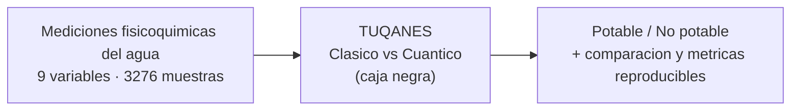
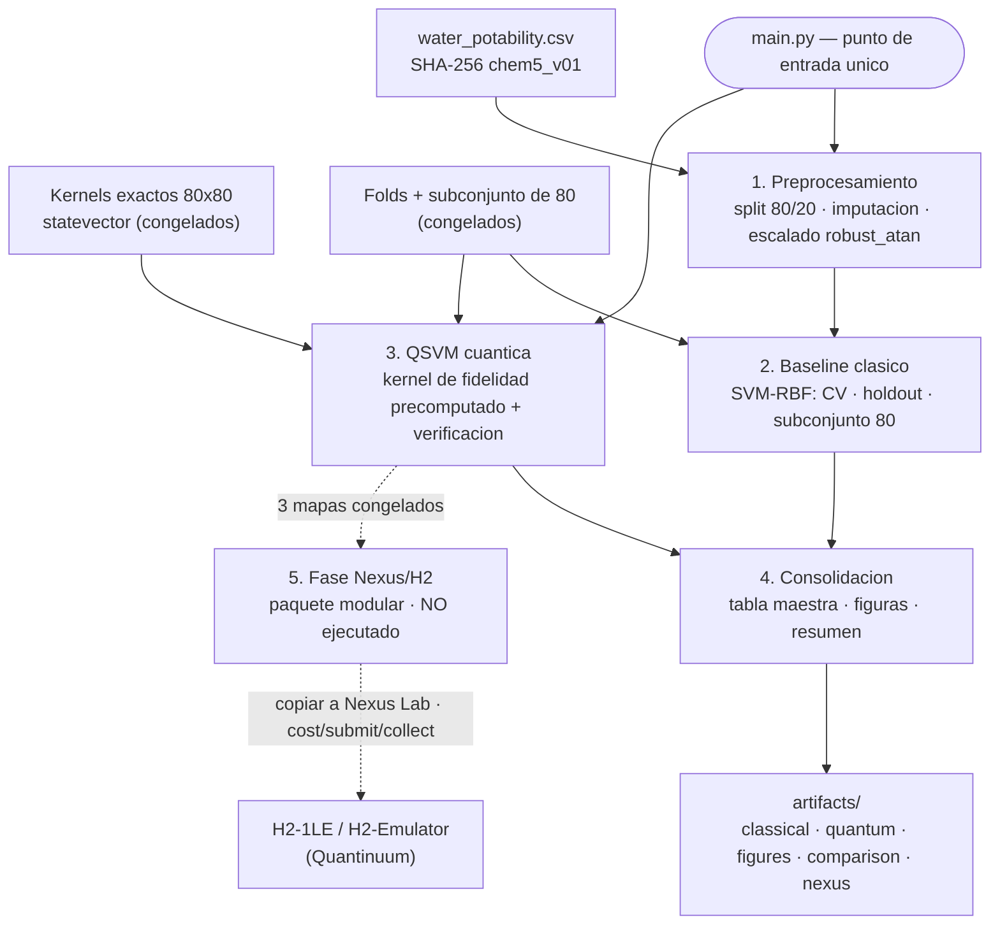

# TuQanes — Diagrama general (vista de caja negra)

Este documento resume, en dos niveles de abstracción, **todo lo que se hizo** en el proyecto.
Para el detalle completo (cifras, tablas, decisiones) ver el [README.md](README.md) principal.

---

## Nivel 1 — Vista de caja negra (muy general)

En su forma más abstracta, TuQanes es una caja que recibe mediciones del agua y devuelve una
predicción de potabilidad junto con una comparación reproducible entre un modelo clásico y uno
cuántico.

- **Entrada:** el dataset `water_potability.csv` (mediciones fisicoquímicas).
- **Caja negra:** el sistema que entrena y compara una SVM clásica y una QSVM cuántica.
- **Salida:** la clasificación potable/no potable y todas las métricas, figuras y comparaciones
  reproducibles.

---

## Nivel 2 — Vista por bloques (un poco más desarrollada)

Al abrir la caja negra aparecen cinco bloques, orquestados por un único punto de entrada
(`main.py`). La fase cuántica en hardware (Nexus/H2) queda como un bloque **modular y no
ejecutado** (línea punteada).

---

## Explicación de cada bloque

- **`main.py` (orquestador).** Punto de entrada único. Con un solo comando (`python main.py`)
  ejecuta las etapas 1–4 y consolida todo en `artifacts/`. También permite correr etapas
  sueltas (`--stage classical|quantum|figures|report|nexus`).

- **Entradas congeladas (D1, D2, D3).** Solo lectura. El dataset canónico (verificado por
  SHA-256), los kernels de fidelidad exactos (matrices 80×80 calculadas con `pytket`) y los
  folds del subconjunto de 80 filas. Nunca se modifican; garantizan que las cifras sean
  estables entre corridas.

- **1. Preprocesamiento.** Divide train/holdout **antes** de transformar, imputa, escala con
  `robust_atan` y fija los folds. Aquí se aplica la gobernanza de datos que evita fuga de
  información.

- **2. Baseline clásico (SVM-RBF).** Entrena y evalúa la referencia clásica sobre el dataset
  completo (CV + holdout de 656) y sobre el mismo subconjunto de 80 filas que usa la parte
  cuántica, para una comparación justa.

- **3. QSVM cuántica.** Ajusta una SVM con **kernel de fidelidad precomputado** sobre los
  kernels congelados y los mismos folds. Toma las cifras reportadas de los artefactos y corre
  una **verificación independiente** (recómputo) para corroborarlas sin depender de `pytket`.

- **4. Consolidación.** Une clásico y cuántico en una **tabla maestra**, genera las **figuras
  con barras de error** (ranking de mapas, heatmaps de kernel, matriz de confusión) y un
  resumen en Markdown. Todo se escribe en `artifacts/`.

- **5. Fase Nexus/H2 (modular, NO ejecutada).** Los 3 mejores mapas (uno por familia) se
  congelan en un **paquete autocontenido** listo para copiar a Nexus Lab y ejecutar por etapas
  (`cost` → `submit` → `collect`) en `H2-1LE` o `H2-Emulator`. No se corre desde `main.py`
  porque consume cuota (HQC); sus últimos jobs de 64 muestras quedaron enviados pero **sin
  recolectar**.

- **Salida (`artifacts/`).** Carpeta única con métricas clásicas y cuánticas, figuras, tabla
  maestra comparativa y el estado/comparación de la fase Nexus. Es lo que respalda el informe
  técnico.
