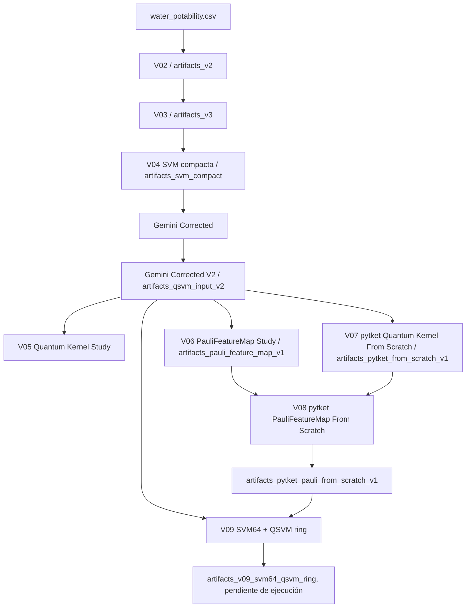

# Challenge 2 — Water Potability: SVM clásica, kernels cuánticos y QSVM con `pytket`

> **Documento maestro del proyecto**  
> Última actualización: 23 de julio de 2026  
> Ubicación prevista: `MyDrive/Colab Notebooks/README.md`

---

## 1. Resumen ejecutivo

Este proyecto estudia la predicción de potabilidad del agua a partir de nueve mediciones fisicoquímicas y compara dos familias de modelos:

1. una **SVM clásica con kernel RBF**, desarrollada y auditada sobre el dataset completo;
2. una **QSVM con kernel cuántico de fidelidad**, implementada primero como estudio de mapas de características y posteriormente desde cero con `pytket`.

El proyecto se relaciona con el **Objetivo de Desarrollo Sostenible 6 — Agua limpia y saneamiento**. Su propósito técnico no es afirmar ventaja cuántica a cualquier costo, sino construir un protocolo reproducible que permita responder:

- si los datos contienen una señal clásica útil;
- si un mapa de características cuántico induce una geometría diferente;
- si esa geometría produce una mejora estable frente a baselines clásicos comparables;
- qué recursos, limitaciones y riesgos aparecen antes de ejecutar en hardware real.

La conclusión actual es prudente:

- La mejor referencia clásica completa es la configuración `max_f1_v3`, con **F1 ≈ 0.6297** en un holdout bloqueado de 656 filas.
- Ese F1 se obtiene con un umbral orientado a la métrica académica y produce demasiados falsos positivos para certificar agua potable.
- El mejor mapa cuántico disciplinadamente seleccionado hasta ahora es `pauli_Z_ZZ_ring_r1_robust` con kernel `centered_normalized`.
- En el estudio de 80 filas, ese mapa tuvo **F1 CV ≈ 0.5570 ± 0.0714**, pero en el holdout final obtuvo **F1 ≈ 0.4424**, por debajo de la SVM RBF clásica entrenada sobre las mismas 80 filas (**F1 ≈ 0.5234**).
- Por tanto, todavía **no existe evidencia de ventaja cuántica**. Sí existe una base experimental reproducible para continuar investigando.

El notebook más reciente, `V09_Challenge2_SVM64_QSVM_pytket_ring.ipynb`, unifica el baseline clásico completo, la misma SVM sobre 64 muestras bloqueadas y una única QSVM `pauli_Z_ZZ_ring_r1_robust`. El notebook fue creado, pero sus resultados deben considerarse **pendientes hasta ejecutar todas sus celdas**.

---

## 2. Propósito y alcance del proyecto

### 2.1 Propósito científico

Comparar una SVM clásica y una QSVM bajo condiciones controladas, separando claramente:

- mejora real de generalización;
- efecto del umbral de decisión;
- efecto del tamaño de muestra;
- efecto del preprocesamiento;
- efecto del mapa cuántico;
- efecto del ruido y de los shots;
- diferencias entre simulación ideal y hardware.

### 2.2 Propósito de ingeniería

Construir una cadena reproducible de datos y artefactos que permita:

- reconstruir cada experimento;
- verificar hashes y particiones;
- evitar fuga de información;
- reutilizar exactamente las mismas filas y folds;
- comparar modelos sobre la misma base;
- exportar kernels, predicciones, métricas, circuitos y manifiestos;
- preparar una migración posterior a hardware de Quantinuum.

### 2.3 Qué no es este proyecto

Este proyecto **no es un sistema de certificación de agua potable**. El dataset no contiene información geográfica, temporal ni de procedencia suficiente para afirmar validez regulatoria o clínica. Los resultados deben entenderse como:

- benchmark académico;
- demostración de metodología;
- estudio exploratorio de kernels;
- herramienta potencial de screening, nunca sustituto de un análisis de laboratorio.

---

## 3. Dataset y contrato de datos

### 3.1 Dataset principal

Archivo:

```text
water_potability.csv
```

Características:

- 3,276 filas;
- 9 variables fisicoquímicas;
- variable objetivo `Potability`;
- clase `0`: no potable;
- clase `1`: potable.

Distribución:

| Clase | Filas | Proporción aproximada |
|---|---:|---:|
| No potable (`0`) | 1,998 | 61.0% |
| Potable (`1`) | 1,278 | 39.0% |

Variables:

```text
ph
Hardness
Solids
Chloramines
Sulfate
Conductivity
Organic_carbon
Trihalomethanes
Turbidity
```

Valores faltantes:

| Variable | Faltantes | Porcentaje |
|---|---:|---:|
| `Sulfate` | 781 | 23.84% |
| `ph` | 491 | 14.99% |
| `Trihalomethanes` | 162 | 4.95% |
| Resto de variables | 0 | 0% |

SHA-256 del snapshot utilizado:

```text
904004bde729bfe3d2e195f46343bceead09e32a0eb95bb8184e7e20e029b2bf
```

### 3.2 Reglas de gobierno de datos

El protocolo correcto es:

1. dividir entrenamiento y holdout antes de cualquier transformación;
2. preservar `source_index`;
3. ajustar imputadores, escaladores, selectores y geometría local solo con el training correspondiente;
4. no usar el holdout para seleccionar hiperparámetros, mapas, variables o umbrales;
5. mantener las filas cuánticas separadas del holdout;
6. bloquear archivos mediante hashes;
7. conservar los valores faltantes en los archivos `*_raw.csv`;
8. tratar cada fold como un experimento independiente.

---

## 4. Arquitectura lógica del proyecto



### Fuente de verdad recomendada

Para evitar mezclar generaciones:

1. **Baseline clásico completo:** `artifacts_v3`.
2. **Reproducción compacta:** `artifacts_svm_compact`.
3. **64 filas y folds congelados:** `artifacts_qsvm_input_v2`.
4. **Selección cuántica final de 80 filas:** `artifacts_pytket_pauli_from_scratch_v1`.
5. **Comparación unificada futura:** `V09_Challenge2_SVM64_QSVM_pytket_ring.ipynb`.

Las carpetas anteriores deben conservarse por trazabilidad, pero no deben mezclarse como si todas usaran el mismo protocolo.

---

## 5. Evolución de notebooks y generaciones

### 5.1 Generaciones iniciales

#### `Challenge2_Water_Potability_Parte1_SVM_RBF_GridSearch_Optuna.ipynb`

Primera búsqueda amplia de hiperparámetros para una SVM RBF. Sirvió para explorar:

- imputación;
- escalamiento;
- balanceo;
- `C`;
- `gamma`;
- selección mediante Optuna.

Su valor es histórico y exploratorio. No debe considerarse el protocolo final.

#### `V02_Challenge2_Water_Potability_Parte1_SVM.ipynb`

Formalizó una primera versión auditada y produjo `artifacts_v2`.

Contribuciones:

- holdout bloqueado;
- búsqueda de candidatos;
- estabilidad mediante repeticiones;
- auditoría de umbrales;
- exportación de pipeline;
- preparación inicial de un subconjunto cuántico de 64 filas.

#### `V03_Challenge2_Water_Potability_Parte1_SVM.ipynb`

Consolidó el baseline clásico y produjo `artifacts_v3`.

Mejoras principales:

- configuración seleccionada `optuna_trial_46`;
- pipeline con imputación mediana, escalamiento estándar, dos variables de geometría local, Tomek Links y SVC-RBF;
- auditoría anidada de umbrales;
- holdout de referencia congelado;
- exportación de modelo y métricas;
- experimento SVM de 64 filas;
- manifiestos y trazabilidad.

Esta generación es la **fuente de verdad principal del modelo clásico**.

### 5.2 Generación compacta y preparación QSVM

#### `V04_Challenge2_Water_Potability_SVM_Compacta.ipynb`

Reconstruyó la configuración clásica ganadora en una forma más corta y reutilizable.

Produce `artifacts_svm_compact`.

Su función es:

- reproducir el baseline completo;
- generar las mismas 64 filas;
- evaluar la SVM sobre folds fijos;
- servir de puente entre el desarrollo clásico y el cuántico.

#### `Gemini_TEST.ipynb`

Versión inicial de integración. Debe considerarse experimental.

#### `Gemini_TEST_Corrected_Artifacts.ipynb`

Primera corrección metodológica y creación de `artifacts_qsvm_input`.

Incluyó:

- 64 filas reales;
- folds;
- bundle NPZ;
- split assignments;
- controles;
- pipeline clásico corregido.

La métrica clásica guardada en esta versión fue F1 ≈ 0.5655, por lo que no reproducía todavía el baseline `max_f1_v3` completo. Fue sustituida por la versión V2.

#### `Gemini_TEST_Corrected_Artifacts_V2.ipynb`

Versión autoritativa de preparación de inputs QSVM.

Produce `artifacts_qsvm_input_v2` y congela:

- 64 filas reales, 32 por clase;
- cuatro folds;
- 48 filas de training y 16 de validación por fold;
- ocho observaciones por clase en cada validación;
- hashes de filas y folds;
- pipeline clásico completo;
- métricas y predicciones del holdout;
- reglas de preprocesamiento fold-local.

Hashes bloqueados:

```text
qsvm_64_raw.csv:
18f3d62479ec83437de682b4a8b1cb0999ce2cb20f831d82564dca022a258f26

qsvm_64_folds.csv:
9865e4d97868a7c93c96094062ddb3cd4fd82075a9cede748978b0455f96b98a
```

Esta carpeta es la **fuente de verdad para la comparación de 64 filas**.

### 5.3 Estudios de kernels cuánticos

#### `V05_Challenge2_Quantum_Kernel_Feature_Map_Study.ipynb`

Primera etapa de estudio sistemático de kernels.

La carpeta `artifacts_quantum_kernel_v1` está actualmente vacía. Esto significa que:

- el notebook puede haber sido exploratorio;
- los artefactos no se persistieron;
- no debe usarse como fuente de métricas finales.

#### `V06_Challenge2_PauliFeatureMap_Study.ipynb`

Estudio amplio de variantes de Pauli.

Produce `artifacts_pauli_feature_map_v1`.

Variantes exploradas:

- términos locales: `Z`, `X`, `Y`, `XYZ`;
- interacciones: `ZZ`, `XX`, `YY`, combinaciones;
- topología: lineal, circular y full;
- repeticiones: `r1`, `r2`;
- escalamiento: min-max, clipping estándar, arctan;
- amplitud `alpha`;
- sensibilidad a shots;
- sensibilidad a ruido;
- geometría y espectro del kernel;
- recursos del circuito.

Resultado importante:

- Algunas configuraciones obtuvieron F1 alto por comportamiento degenerado.
- `P_X_XX_r1_linear_a2_minmax` obtuvo F1 = 0.6667, pero accuracy y balanced accuracy = 0.5, recall = 1.0 y rango efectivo ≈ 1. Es esencialmente un clasificador de una sola clase y **no debe considerarse ganador**.
- Una alternativa no degenerada, `P_Z_r1_linear_a2_minmax`, obtuvo F1 medio ≈ 0.6454 y balanced accuracy ≈ 0.6094.
- `P_XYZ_XXYYZZ_r1_linear_a2_minmax` obtuvo F1 medio ≈ 0.6297, pero con desviación ≈ 0.1171 y mayor complejidad.

Lección: **F1 por sí solo no es suficiente para seleccionar un kernel**. Deben revisarse balanced accuracy, MCC, estabilidad, espectro, concentración y recursos.

### 5.4 Implementaciones desde cero con `pytket`

#### `V07_Challenge2_pytket_Quantum_Kernel_From_Scratch.ipynb`

Construyó un kernel de fidelidad con `pytket` sin depender de Qiskit.

Produce `artifacts_pytket_from_scratch_v1`.

Comparó:

- `pytket_linear_r1`;
- `pytket_ring_r1`;
- `pytket_linear_r2`.

Resultados CV sobre 64 filas:

| Mapa | Accuracy media | F1 medio | MCC medio |
|---|---:|---:|---:|
| `pytket_ring_r1` | 0.5938 | **0.5738** | 0.1905 |
| `pytket_linear_r1` | **0.6094** | 0.5491 | **0.2215** |
| `pytket_linear_r2` | 0.5938 | 0.5419 | 0.1928 |

Interpretación:

- `ring_r1` tuvo mejor F1;
- `linear_r1` tuvo mejor accuracy y MCC;
- repetir el circuito no produjo una mejora clara;
- una capa es preferible cuando el rendimiento es similar.

#### `V08_Challenge2_pytket_PauliFeatureMap_From_Scratch.ipynb`

Versión más disciplinada y completa del estudio de Pauli con `pytket`.

Produce `artifacts_pytket_pauli_from_scratch_v1`.

Decisiones:

- 80 filas balanceadas;
- cinco variables seleccionadas sin usar las filas cuánticas ni el holdout;
- cinco folds balanceados;
- cinco configuraciones Pauli;
- kernels raw y centered-normalized;
- selección de `C` anidada;
- selección del mapa antes de abrir el holdout;
- comparación final con SVM RBF clásica sobre las mismas 80 filas;
- sensibilidad a shots;
- comprobaciones de reproducibilidad;
- circuitos QASM y HTML;
- no se importa Qiskit.

Mapa seleccionado:

```text
pauli_Z_ZZ_ring_r1_robust
kernel_mode = centered_normalized
C = 10.0
reps = 1
topology = ring
scaling = robust_atan
alpha = 1.0
```

Resultados CV:

| Modelo | F1 medio | Desviación F1 | Balanced accuracy | MCC |
|---|---:|---:|---:|---:|
| QSVM ring centered-normalized | **0.5570** | 0.0714 | 0.5750 | 0.1543 |
| QSVM ring raw | 0.5430 | 0.1295 | 0.5625 | 0.1270 |
| Baseline RBF del experimento | 0.4046 | 0.0938 | 0.3875 | -0.2346 |

Evaluación final en holdout:

| Modelo | F1 | Balanced accuracy | Recall | Specificity | MCC |
|---|---:|---:|---:|---:|---:|
| QSVM `pauli_Z_ZZ_ring_r1_robust` | 0.4424 | 0.5287 | 0.4648 | 0.5925 | 0.0565 |
| SVM RBF sobre las mismas 80 filas | **0.5234** | **0.5556** | **0.6563** | 0.4550 | **0.1103** |

Conclusión:

- El mapa ring fue el mejor candidato cuántico en CV.
- La aparente ventaja CV no sobrevivió al holdout.
- El baseline clásico sobre las mismas 80 filas generalizó mejor.
- No hay evidencia de ventaja cuántica.

### 5.5 Notebook consolidado

#### `V09_Challenge2_SVM64_QSVM_pytket_ring.ipynb`

Integra tres niveles de evaluación:

1. SVM completa sobre el holdout bloqueado;
2. exactamente la misma SVM sobre las 64 filas bloqueadas;
3. una sola QSVM `pauli_Z_ZZ_ring_r1_robust` sobre las mismas filas y folds.

Configuración clásica congelada:

```text
C = 1.2519747115129674
gamma = 0.09539784477077082
geometry_neighbors = 5
threshold max_f1_v3 = -0.9516512901090459
threshold safety_recommended = -0.3032644845043456
```

Configuración cuántica congelada:

```text
9 qubits
Z local
ZZ ring
1 capa
robust_atan
kernel centered_normalized
SVC precomputed
C = 10.0
```

Carpeta de salida prevista:

```text
artifacts_v09_svm64_qsvm_ring
```

Estado:

> **Notebook creado, pero no se deben reportar resultados de V09 hasta ejecutar completamente todas las celdas y generar la carpeta de artefactos.**

---

## 6. Inventario y propósito de carpetas `artifacts`

### 6.1 `artifacts_v2`

Primera generación clásica auditada.

Contenido por categoría:

- `audit_test_v2_locked.csv`: holdout bloqueado;
- `v2_optuna_trials.csv`: historial de búsqueda;
- `v2_candidate_stability_repeats.csv`: estabilidad de candidatos;
- `v2_candidate_summary.csv`: resumen de candidatos;
- `v2_threshold_audit.csv`: políticas de umbral;
- `v2_selected_configuration.json`: configuración elegida;
- `v2_audit_test_metrics.csv`: métricas de holdout;
- `v2_confusion_matrices.png`: matrices de confusión;
- `svm_rbf_v2_selected_pipeline.joblib`: pipeline;
- archivos `quantum_subset_v2_64_*`: primeras 64 filas para etapa cuántica;
- `quantum_strict_9d_preprocessor.joblib`: preprocesador;
- `v2_manifest.json`: trazabilidad.

Interpretación:

- Es una base histórica importante.
- El holdout de esta generación se reutilizó como referencia.
- Fue superada por V3 para la selección clásica final.

### 6.2 `artifacts_v3`

Fuente principal del baseline clásico.

Archivos principales:

- `reference_holdout_v2_locked.csv`: holdout bloqueado;
- `v3_optuna_trials.csv`: búsqueda;
- `v3_candidate_stability_repeats.csv`: estabilidad;
- `v3_candidate_summary.csv`: comparación;
- `v3_threshold_nested_audit.csv`: auditoría anidada de umbral;
- `v3_selected_configuration.json`: parámetros congelados;
- `v3_reference_holdout_metrics.csv`: métricas oficiales;
- `svm_rbf_v3_selected_pipeline.pkl`: modelo completo;
- `v3_reference_confusion_matrices.png`: visualización;
- `v3_selected_feature_names.csv`: nueve variables originales más:
  - `local_mean_neighbor_distance`;
  - `isolation_anomaly_score`.
- archivos `svm64_*`: experimento clásico de 64 filas;
- `v3_manifest.json` y `svm64_manifest.json`: trazabilidad.

Interpretación:

- Use `v3_selected_configuration.json` para reconstruir el modelo.
- Use `v3_reference_holdout_metrics.csv` como fuente oficial del benchmark clásico.
- No vuelva a seleccionar parámetros usando el holdout.

### 6.3 `artifacts_svm_compact`

Reproducción compacta del pipeline V3.

Archivos:

- `full_svm_metrics.csv`;
- `full_svm_rbf_pipeline.joblib`;
- `svm64_training_raw.csv`;
- `svm64_fixed_cv_folds.csv`;
- `svm64_cv_metrics.csv`;
- `svm64_oof_predictions.csv`;
- `svm64_rbf_pipeline.joblib`;
- `compact_manifest.json`.

Interpretación:

- Facilita la ejecución y revisión.
- Las pequeñas diferencias respecto a V3 pueden depender de reconstrucción, semillas o versiones.
- Los folds de 64 muestran alta variabilidad: el F1 por fold bajo umbral 0 varió aproximadamente entre 0.222 y 0.696.

### 6.4 `artifacts_qsvm_input`

Primera versión corregida de preparación QSVM.

Archivos:

- `qsvm_64_raw.csv`;
- `qsvm_64_folds.csv`;
- `qsvm_64_bundle.npz`;
- `qsvm_64_fold_summary.csv`;
- `split_assignments.csv`;
- `corrected_full_svm_pipeline.joblib`;
- `corrected_full_svm_metrics.csv`;
- `qsvm_data_manifest.json`;
- `artifact_checks.csv`.

Interpretación:

- Fue una etapa intermedia.
- El baseline guardado no reprodujo todavía `max_f1_v3`.
- Debe considerarse reemplazada por `artifacts_qsvm_input_v2`.

### 6.5 `artifacts_qsvm_input_v2`

Fuente autoritativa de las 64 filas y folds.

Archivos:

- `qsvm_64_raw.csv`: 64 filas sin imputar ni escalar;
- `qsvm_64_folds.csv`: fold asignado a cada fila;
- `qsvm_64_bundle.npz`: arrays compactos;
- `qsvm_64_fold_summary.csv`: balance por fold;
- `split_assignments.csv`: training vs holdout;
- `full_svm_metrics_v2.csv`: métricas de la SVM completa;
- `full_svm_holdout_predictions_v2.csv`: predicciones;
- `full_svm_rbf_pipeline_v2.joblib`: pipeline;
- `qsvm_data_manifest_v2.json`: configuración y hashes;
- `artifact_checks_v2.csv`: controles.

Interpretación:

- Cualquier experimento posterior de 64 filas debe consumir estos archivos.
- No se deben volver a seleccionar las observaciones.
- El preprocesamiento debe ajustarse dentro de cada fold.

### 6.6 `artifacts_quantum_kernel_v1`

Estado actual:

```text
vacía
```

Interpretación:

- No contiene evidencia persistida.
- No usar como fuente de resultados.
- Mantener solo como marcador histórico o eliminar después de documentar la decisión.

### 6.7 `artifacts_pauli_feature_map_v1`

Gran repositorio de ablación cuántica.

Archivos principales:

- `pauli_manifest.json`;
- `pauli_checks.csv`;
- `pauli_global_kernels.npz`;
- `pauli_fold_metrics.csv`;
- `pauli_cv_summary.csv`;
- `pauli_geometry.csv`;
- `pauli_circuit_resources.csv`;
- `pauli_ablation_summary.csv`;
- `pauli_shot_sensitivity.csv`;
- `pauli_noise_sensitivity.csv`;
- `pauli_f1_comparison.png`;
- `pauli_best_circuit.png`;
- patrones:
  - `heatmap_*.png`;
  - `distribution_*.png`;
  - `spectrum_*.png`.

Interpretación:

- Es un laboratorio exploratorio.
- Permite estudiar geometría, concentración y recursos.
- No se debe seleccionar un mapa solo por F1.
- Revisar especialmente:
  - `balanced_accuracy`;
  - `MCC`;
  - `similarity_gap`;
  - `effective_rank`;
  - distancia a identidad y uniforme;
  - sensibilidad a shots y ruido.

### 6.8 `artifacts_pytket_from_scratch_v1`

Primera implementación de kernels con `pytket`.

Archivos:

- `DATA_LOCK.json`;
- `FINAL_MANIFEST.json`;
- `pytket_cv_summary.csv`;
- `pytket_fold_metrics.csv`;
- `pytket_inner_c_search.csv`;
- `pytket_kernel_geometry.csv`;
- `pytket_circuit_resources.csv`;
- `pytket_shot_sensitivity*.csv`;
- `pytket_global_kernels.npz`;
- `kernel_pytket_*_fold*.npz`;
- `circuit_pytket_*.qasm`;
- `heatmap_pytket_*.png`;
- snapshot del dataset;
- filas, folds, split assignments;
- selección de variables;
- checks de reproducibilidad.

Interpretación:

- Demuestra la construcción del kernel sin Qiskit.
- Permite comparar lineal, ring y dos repeticiones.
- Es la base de ingeniería para V08.

### 6.9 `artifacts_pytket_pauli_from_scratch_v1`

Fuente principal del estudio cuántico final de 80 filas.

Categorías:

**Gobierno y trazabilidad**

- `RUN_CONFIG.json`;
- `DATA_LOCK.json`;
- `FINAL_MANIFEST.json`;
- `pytket_pauli_reproducibility_checks.csv`.

**Datos**

- `pytket_pauli_quantum80_selected.csv`;
- `pytket_pauli_quantum80_folds.csv`.

**Métricas y selección**

- `pauli_all_fold_metrics.csv`;
- `pauli_inner_c_search.csv`;
- `pauli_oof_predictions.csv`;
- `pauli_cv_summary.csv`;
- `selected_pauli_configuration.json`;
- `FINAL_LOCKED_HOLDOUT_METRICS.csv`;
- `FINAL_LOCKED_HOLDOUT_PREDICTIONS.csv`.

**Kernels**

- `pauli_global_kernels.npz`;
- `kernel_<map>_<mode>_fold<n>.npz`.

**Geometría y sensibilidad**

- `pauli_kernel_geometry.csv`;
- `pauli_shot_sensitivity.csv`;
- `pauli_shot_sensitivity_summary.csv`.

**Circuitos y recursos**

- `pauli_circuit_resources.csv`;
- `circuit_*.qasm`;
- `circuit_*_boxed.html`;
- `heatmap_*.png`;
- `spectrum_*.png`.

Interpretación:

- `pauli_cv_summary.csv` se usa para seleccionar el mapa.
- `selected_pauli_configuration.json` congela la decisión.
- `FINAL_LOCKED_HOLDOUT_METRICS.csv` es final y no debe retroalimentar la búsqueda.
- Los kernels por fold permiten auditoría y reutilización.
- Los archivos QASM permiten revisar y compilar los circuitos.

### 6.10 `artifacts_v09_svm64_qsvm_ring`

Carpeta prevista al ejecutar V09.

Deberá contener:

- `full_svm_metrics.csv`;
- `full_svm_holdout_predictions.csv`;
- `full_svm_pipeline.joblib`;
- copias bloqueadas de las 64 filas y folds;
- `svm64_oof_metrics.csv`;
- `svm64_fold_metrics.csv`;
- `svm64_oof_predictions.csv`;
- `qsvm_ring_fold_<n>.npz`;
- `qsvm_ring_fold_metrics.csv`;
- `qsvm_ring_oof_metrics.csv`;
- `qsvm_ring_oof_predictions.csv`;
- `FINAL_COMPARISON_SUMMARY.csv`;
- QASM y HTML del circuito;
- `FINAL_MANIFEST.json`;
- `REPRODUCIBILITY_CHECKS.csv`.

Hasta que exista esta carpeta, V09 se considera pendiente.

---

## 7. Cómo interpretar los tipos de artefactos

| Tipo | Propósito |
|---|---|
| `*_manifest.json` | Configuración, versiones, hashes, archivos generados y procedencia |
| `DATA_LOCK.json` | Evidencia de que filas, particiones y configuración quedaron congeladas |
| `RUN_CONFIG.json` | Parámetros de ejecución |
| `*_checks.csv` | Validaciones de reproducibilidad y ausencia de leakage |
| `*_metrics.csv` | Métricas agregadas |
| `*_fold_metrics.csv` | Variabilidad entre folds |
| `*_predictions.csv` | Predicciones fila por fila para auditoría |
| `*_raw.csv` | Datos originales sin transformación |
| `*_folds.csv` | Asignación fija de folds |
| `*.joblib`, `*.pkl` | Pipelines clásicos serializados |
| `*.npz` | Kernels, arrays, índices, etiquetas y bundles |
| `*.qasm` | Circuitos descompuestos o exportables |
| `*.html` | Diagrama interactivo o visual del circuito |
| `heatmap_*.png` | Estructura visual de la matriz de kernel |
| `spectrum_*.png` | Autovalores y rango efectivo |
| `distribution_*.png` | Distribución de similitudes |
| `*_shot_sensitivity.csv` | Robustez ante número finito de shots |
| `*_noise_sensitivity.csv` | Robustez ante perturbaciones simuladas |

### Orden recomendado para auditar una carpeta

1. leer el manifiesto;
2. revisar checks;
3. verificar dataset y hashes;
4. revisar configuración seleccionada;
5. leer métricas por fold;
6. revisar predicciones;
7. inspeccionar geometría y espectro;
8. observar recursos del circuito;
9. abrir el holdout final solo al final.

---

## 8. Resultados principales consolidados

### 8.1 Baseline clásico completo

Configuración seleccionada:

```text
candidate: optuna_trial_46
imputer: median
scaler: standard
local_geometry: density_anomaly
geometry_neighbors: 5
sampling: Tomek Links
C: 1.2519747115129674
gamma: 0.09539784477077082
```

Variables finales:

- nueve variables originales;
- distancia media local a vecinos;
- score de anomalía de Isolation Forest.

Resultados oficiales en holdout de 656 filas:

| Política | Threshold | F1 | Recall potable | Specificity no potable | Balanced accuracy | MCC | FP | FN |
|---|---:|---:|---:|---:|---:|---:|---:|---:|
| `default_zero` | 0.0000 | 0.5153 | 0.3945 | **0.9125** | 0.6535 | **0.3695** | 35 | 155 |
| `max_f1_v3` | -0.9517 | **0.6297** | **0.8867** | 0.4050 | 0.6459 | 0.3132 | 238 | **29** |
| `safety_recommended` | -0.3033 | 0.5677 | 0.5078 | 0.8200 | **0.6639** | 0.3464 | 72 | 126 |

Interpretación:

- `max_f1_v3` cumple el objetivo académico.
- Su specificity de 0.405 implica que 238 de 400 aguas no potables fueron clasificadas como potables.
- No es una política segura para uso real.
- `safety_recommended` reduce falsos positivos, pero 72 de 400 sigue siendo demasiado para certificación.
- `default_zero` tiene la menor tasa de falsos positivos, pero pierde muchas aguas potables.

### 8.2 SVM entrenada con solo 64 filas

El experimento de 64 filas muestra alta inestabilidad.

En la generación V3, al generalizar al holdout completo:

- F1 ≈ 0.5577;
- recall ≈ 0.9531;
- specificity ≈ 0.0625;
- 375 falsos positivos.

Esto demuestra que un modelo entrenado con 64 observaciones puede parecer sensible, pero generalizar muy mal en la clase no potable.

### 8.3 Mejor selección cuántica disciplinada

`pauli_Z_ZZ_ring_r1_robust`, centered-normalized:

- F1 CV ≈ 0.5570;
- desviación ≈ 0.0714;
- balanced accuracy ≈ 0.5750;
- MCC ≈ 0.1543;
- F1 holdout ≈ 0.4424.

Comparación con RBF clásica sobre las mismas 80 filas:

- F1 clásica ≈ 0.5234;
- MCC clásica ≈ 0.1103.

No existe ventaja cuántica demostrada.

### 8.4 Sensibilidad a shots del mapa seleccionado

En la simulación del kernel global:

| Shots | MAE medio contra kernel exacto |
|---:|---:|
| 256 | ≈ 0.00744 |
| 1,024 | ≈ 0.00375 |
| 4,096 | ≈ 0.00186 |

El error disminuye con shots, pero estos resultados:

- usan una simulación estadística ideal;
- no incluyen ruido físico real;
- no incluyen errores de compilación, SPAM ni drift;
- no prueban rendimiento en hardware.

---

## 9. Análisis retrospectivo: cómo empezar de nuevo sin repetir errores

### 9.1 Pregunta central

Si se iniciara nuevamente con el conocimiento actual, el objetivo debería formularse así:

> Determinar si un kernel cuántico produce una geometría útil, estable y reproducible que no pueda obtenerse de manera sencilla con un kernel clásico comparable.

No se debe comenzar intentando “demostrar ventaja cuántica”.

### 9.2 Tres preguntas que no deben mezclarse

1. ¿Existe un clasificador clásico razonable?
2. ¿El kernel cuántico representa los datos de forma diferente?
3. ¿Esa representación mejora establemente al baseline clásico?

La primera tiene evidencia razonable.  
La segunda tiene resultados exploratorios.  
La tercera todavía no está demostrada.

### 9.3 Contrato experimental desde el primer día

Antes de entrenar:

- congelar dataset y hash;
- bloquear holdout;
- fijar filas cuánticas;
- fijar folds;
- fijar semillas;
- definir métrica primaria;
- definir política de umbral;
- separar exploración y evaluación final;
- documentar criterio de éxito;
- prohibir cualquier ajuste posterior al holdout.

### 9.4 Métrica correcta para el problema

En potabilidad, un falso positivo significa:

> declarar potable una muestra que no lo es.

Por tanto, F1 no debería ser la única métrica operativa.

Una política más apropiada sería:

```text
maximizar recall de potable
sujeto a specificity >= 0.95
```

Otra alternativa es un sistema de tres decisiones:

- potable con alta confianza;
- no potable con alta confianza;
- indeterminado: requiere laboratorio.

### 9.5 Lo que debe aprender una persona nueva

#### Nivel 1 — Integridad experimental

- leakage;
- partición antes de transformación;
- holdout bloqueado;
- seeds, hashes y manifiestos;
- reconstrucción de experimentos.

#### Nivel 2 — SVM clásica

- margen;
- RBF;
- `C` y `gamma`;
- balanceo;
- umbral;
- matriz de confusión;
- F1, specificity, balanced accuracy y MCC.

#### Nivel 3 — Kernel cuántico

- mapa \(U(x)\);
- estado \(|\phi(x)\rangle\);
- fidelidad \(|\langle\phi(x)|\phi(z)\rangle|^2\);
- matriz de Gram;
- PSD;
- centrado;
- normalización;
- alignment;
- rango efectivo;
- concentración del kernel.

#### Nivel 4 — `pytket`

- `PauliExpBox`;
- términos `Z` y `ZZ`;
- topología lineal y ring;
- construcción de circuitos;
- statevectors;
- overlap;
- kernel train y cross-kernel;
- QASM;
- compilación dirigida.

#### Nivel 5 — Interpretación científica

La persona debe poder comunicar:

> El kernel cuántico fue mejor en esta validación cruzada, pero no generalizó al holdout; por tanto, el resultado es exploratorio y no prueba ventaja.

---

## 10. Limitaciones, riesgos y mitigaciones

| Riesgo o limitación | Impacto | Mitigación recomendada |
|---|---|---|
| Solo 64 u 80 filas cuánticas | Alta varianza | Repetir en múltiples subconjuntos bloqueados y escalar a 128/256 |
| 16 filas de validación por fold en V09 | Un error cambia accuracy 6.25 puntos | Reportar folds, intervalos y bootstrap |
| Subconjuntos 50/50 | No representan prevalencia 61/39 | Evaluar también con prevalencia natural |
| Optimización por F1 | Exceso de falsos positivos | Restricción de specificity o coste asimétrico |
| 23.84% faltantes en `Sulfate` | Sesgo de imputación | Añadir indicadores de missingness y comparar imputadores |
| Selección entre muchos mapas | Optimismo de selección | Nested CV y congelación antes del holdout |
| Statevector exacto | No representa hardware | Separar ideal, shot-based, noisy y hardware |
| Complejidad \(O(n^2)\) del kernel | Coste de circuitos | Nyström, landmarks o batching |
| Sin validación externa | Generalización desconocida | Dataset externo o separación por origen |
| Cambios de librerías | Diferencias reproducibles | Fijar versiones y guardar entorno |
| Carpetas históricas similares | Confusión de fuente de verdad | Aplicar jerarquía de artefactos de este README |
| `artifacts_quantum_kernel_v1` vacía | Evidencia incompleta | Marcar como histórica o retirar |
| V09 no ejecutado | No hay comparación final 64 vs 64 | Ejecutar y revisar manifiesto antes de reportar |

---

## 11. Recomendaciones técnicas y de gestión

### 11.1 Mantener tres referencias separadas

1. **Benchmark académico:** SVM completa con `max_f1_v3`.
2. **Política prudente:** threshold orientado a specificity.
3. **Experimento científico:** comparación SVM/QSVM sobre las mismas filas y folds.

No deben mezclarse sus conclusiones.

### 11.2 No crear más mapas antes de estabilizar el protocolo

Mantener como hipótesis primaria:

```text
pauli_Z_ZZ_ring_r1_robust
```

Control cuántico:

```text
pauli_Z_ZZ_linear_r1_robust
```

Control clásico:

```text
SVM RBF sobre exactamente las mismas filas
```

### 11.3 Ejecutar V09 como siguiente hito

Criterios de aceptación:

- todos los checks en `True`;
- hashes de 64 filas y folds correctos;
- carpeta `artifacts_v09_svm64_qsvm_ring` creada;
- resultados SVM64 y QSVM64 sobre los mismos folds;
- manifiesto final;
- predicciones OOF completas;
- ninguna comparación engañosa con el holdout completo.

### 11.4 Escalar de manera progresiva

Plan sugerido:

| Fase | Tamaño | Objetivo |
|---|---:|---|
| Fase A | 64 | Reproducibilidad |
| Fase B | múltiples 64 | Estabilidad entre subconjuntos |
| Fase C | 128 | Escalabilidad en simulación |
| Fase D | 256 | Confirmar tendencia |
| Fase E | landmarks/Nyström | Reducir coste |
| Fase F | hardware pequeño | Validar pipeline físico |
| Fase G | hardware ampliado | Solo si existe señal estable |

### 11.5 Gate antes de hardware

No ejecutar hardware real hasta cumplir:

- mejora consistente o comportamiento geométrico explicable;
- estabilidad en múltiples subconjuntos;
- kernel no degenerado;
- circuito compatible con topología;
- presupuesto de shots;
- método de reparación PSD;
- baseline clásico congelado;
- criterio de abandono definido.

---

## 12. Estado de gestión del proyecto

| Entregable | Estado | Fuente |
|---|---|---|
| Dataset y hash | Completo | `water_potability.csv` |
| Holdout clásico bloqueado | Completo | `artifacts_v3` |
| Baseline SVM completo | Completo | `artifacts_v3` |
| Política `max_f1_v3` | Completo | `v3_selected_configuration.json` |
| Política prudente | Completo, no suficiente para certificación | `v3_reference_holdout_metrics.csv` |
| 64 filas y folds congelados | Completo | `artifacts_qsvm_input_v2` |
| Ablación amplia de Pauli | Completo | `artifacts_pauli_feature_map_v1` |
| Kernel desde cero con `pytket` | Completo | `artifacts_pytket_from_scratch_v1` |
| Selección Pauli con holdout final | Completo | `artifacts_pytket_pauli_from_scratch_v1` |
| Notebook consolidado V09 | Creado | `V09_Challenge2_SVM64_QSVM_pytket_ring.ipynb` |
| Ejecución y artefactos V09 | Pendiente | `artifacts_v09_svm64_qsvm_ring` |
| Experimentos multi-subconjunto | Pendiente | Próxima fase |
| Hardware Quantinuum | Pendiente | Fase posterior |
| Validación externa | Pendiente crítica | Dataset adicional |

---

## 13. Criterios de éxito recomendados

### Éxito mínimo

- reproducibilidad total;
- cero leakage;
- comparación sobre las mismas filas;
- resultados reportados con incertidumbre;
- circuitos y kernels auditables.

### Éxito científico

- señal cuántica estable en varios subconjuntos;
- MCC y balanced accuracy superiores al control clásico;
- holdout consistente;
- geometría explicable;
- costes de circuito razonables.

### Éxito aplicado

Requeriría además:

- specificity muy alta;
- calibración;
- validación externa;
- abstención;
- datos representativos;
- evaluación de riesgo;
- validación de laboratorio;
- cumplimiento regulatorio.

El proyecto aún no se encuentra en esta fase.

---

## 14. Recomendación final

La estrategia recomendada es:

1. conservar la SVM completa como referencia principal;
2. conservar `max_f1_v3` únicamente como benchmark académico;
3. no presentar el modelo como certificador de potabilidad;
4. mantener `pauli_Z_ZZ_ring_r1_robust` como única hipótesis cuántica primaria;
5. ejecutar completamente V09;
6. repetir el experimento sobre varios subconjuntos bloqueados;
7. aumentar gradualmente el tamaño cuántico;
8. estudiar estabilidad antes de añadir complejidad;
9. probar hardware solo después de obtener evidencia estable en simulación;
10. comunicar resultados negativos con la misma importancia que los positivos.

La mejor contribución del proyecto no sería forzar una supuesta ventaja cuántica. Sería demostrar, con trazabilidad y rigor:

- dónde funciona un kernel cuántico;
- dónde no funciona;
- qué geometría produce;
- qué recursos necesita;
- cómo cambia bajo shots y ruido;
- cuándo un baseline clásico sigue siendo superior.

---

## 15. Guía rápida para continuar

### Para reproducir el baseline clásico

1. abrir `V03_Challenge2_Water_Potability_Parte1_SVM.ipynb` o la versión compacta;
2. verificar `water_potability.csv`;
3. usar `artifacts_v3/v3_selected_configuration.json`;
4. no recalibrar con el holdout;
5. comprobar F1 ≈ 0.6297 para `max_f1_v3`.

### Para reproducir las 64 filas

1. usar `artifacts_qsvm_input_v2/qsvm_64_raw.csv`;
2. verificar el hash;
3. usar `qsvm_64_folds.csv`;
4. ajustar el preprocesamiento dentro de cada fold;
5. no volver a muestrear.

### Para reproducir el mejor mapa cuántico

1. abrir V08;
2. usar `selected_pauli_configuration.json`;
3. construir `Z + ZZ`, ring, una capa;
4. usar `robust_atan`;
5. centrar y normalizar el kernel;
6. usar `C = 10`;
7. comparar contra RBF en las mismas filas.

### Para la comparación consolidada

1. abrir V09;
2. ejecutar en orden;
3. confirmar todos los checks;
4. revisar `FINAL_COMPARISON_SUMMARY.csv`;
5. comparar directamente:
   - `same_svm_64_oof`;
   - `qsvm_ring_64_oof`.
6. No comparar directamente la QSVM de 64 con el holdout completo de 656 como si fueran el mismo experimento.

---

## 16. Glosario

- **OOF:** predicción out-of-fold.
- **Holdout:** partición final no utilizada para selección.
- **F1:** media armónica de precision y recall.
- **Specificity:** proporción de no potables correctamente identificadas.
- **MCC:** Matthews Correlation Coefficient; útil para evaluar ambas clases.
- **Kernel de fidelidad:** similitud cuántica basada en overlap de estados.
- **Centered-normalized:** kernel centrado en training y normalizado.
- **PSD:** matriz semidefinida positiva.
- **Effective rank:** medida de dimensionalidad efectiva del kernel.
- **Kernel concentration:** similitudes excesivamente uniformes o cercanas a identidad.
- **Tomek Links:** limpieza de pares fronterizos entre clases.
- **`PauliExpBox`:** construcción de `pytket` para exponenciales de operadores de Pauli.
- **QASM:** representación textual de circuitos cuánticos.
- **Statevector:** simulación exacta del estado cuántico, sin shots ni ruido físico.

---

